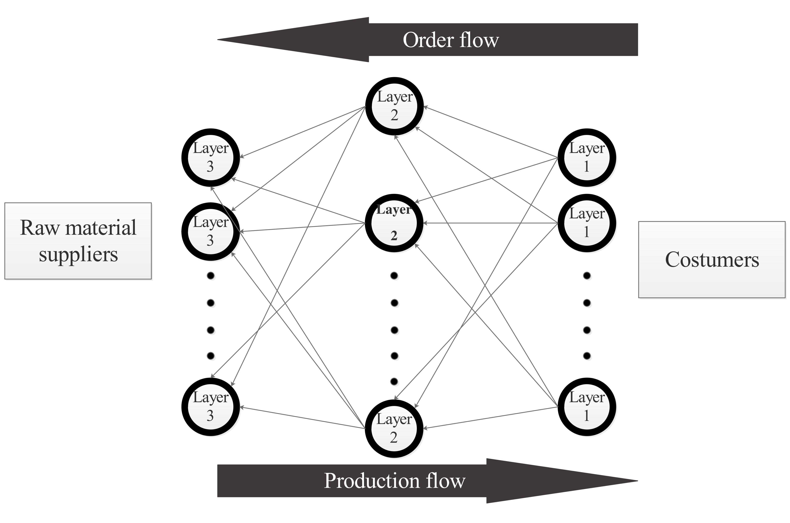
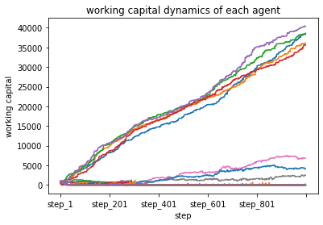
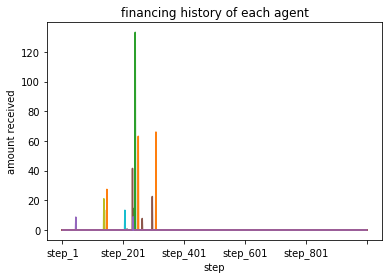
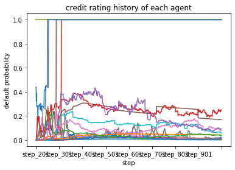
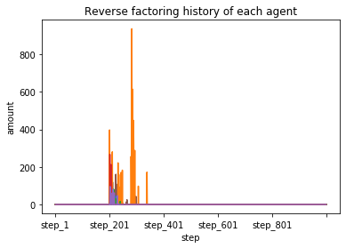
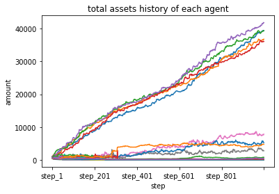
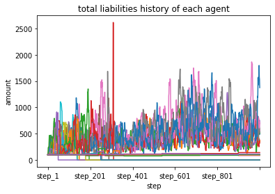
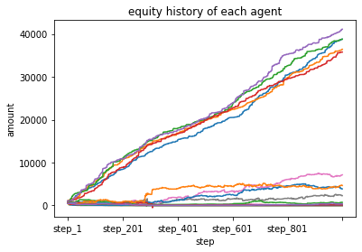

# SCLIB

The agent-based simulation of supply chain finance and credit risk.



## Table of Contents

- [Description](#description)
- [How To Use](#how_to_use)
- [Visualization](#visualizing)

## Description

This repository is developed for the purpose of simulating a supply chain with
Agent-Based approach. The mentioned supply chain is comprised of 3 layers that
refer to the existance of retailers, Manufacturers and suppliers in the model.
Features such as sending orders to upstream agents, delivery of products to
downstream agents, payment execution, bank financing, reverse factoring and
credit risk evaluation are simulated during each step of the model.

## How to use

After downloading the repository the following steps should help you run the
simulation yourself:

#. Make sure the following libraries are installed on your python environment: `numpy, scipy, pandas, matplotlib, xlrd`

#. Prepare an Excel sheet that contains the initial parameters of the agents. Each row of the spreadsheet contains the initial parameters of one agent. Columns hold parameter values for agents of the model. The description and order of column headers are shown below (pleasse be careful about the order and the spelling of parameters):

  * `agent_id`: (integer) An integer showing the unique id of each agent. Please make sure that ids start from zero and stride by one
  * `role`: (string) A character defining the layer to which the agent belongs. Use `r` for retailer, `m` for manufacturer and `s` for supplier. Please make sure that each layer has at least one agent. Otherwise, an exception occures
  * `working_capital`: (float) The initial liquidity of agent
  * `mu_selling_price`: (float) Selling prices are drawn from log-normal distribution. This parameter specifies the average value of the distribution
  * `sigma_selling_price`: (float) The standard deviation of log-normal distribution
  * `q`: (float) Technological coefficient which takes a value between 0 and 1. This parameter specifies the percentage of liquidity that is allowed to be used for production
  * `consumer_demand_mean`: (float) The demand received by each retailer from outside of the supply chain is drawn from exponential distribution. This is the lambda parameter of the distribution
  * `input_margin`: (float) This parameter is the profit margin of suppliers per unit value of sales. Rationally this parameter takes a value between zero and one
  * `interest_rate`: (float) Yearly interest rate of the agent for its external financing. This is the initial rate and after step 300 this parameter will change according to credit risk of the agent
  * `fixed_cost` (float): The fixed cost which is subtracted from agent's liquidity at the beginning of each step
  * `days_between_financing`: (integer) This is the time that should have been passed from agent's last bank financing in order to make the agent eligible for obtaining short term financing once more
  * `financing_period`: (integer) The short_term financing term
  * `ordering period`: (integer) The frequency of ordering by retailers
  * `delivery_period`: (integer) The time that takes an agent to deliver finished goods after it has received all of the raw material from upstream.
  * `fixed_assets`: (float) The value of the agent's fixed assets
  * `payment_term`: (integer) The days between delivery of orders and receiving the related payment
  * `tc_rate`: (float) The yearly interest rate on a trade credit contract. This attribute is not being used in the cuurent version. Since payment delays are fixed, the net value (not compounded by tc_rate) is exchanged
  * `long_term_debt` (float) The value of agent's long term debt

#. Run the model using the following lines of code:

```python
from sclib.generate_agents import GenAgents
from sclib.evolve import Evolve

generate = GenAgents(excel_file = r'file_path')
model = Evolve(generate.list_agents)

model.activate_wcap_financing()  #Optional short-term bank financing
model.activate_SC_financing()    #Optional reverse factoring
model.always_shuffle()           #Otional competition among agents in each layer

Desired_step_number = n #int
model.proceed(Desired_step_number)
```

## Visualization

After using the preceding blocks of code, several dynamics of the model can be plotted. Data is stored in dataframes and in order to
visualize each one (including the dynamics of working capital, short-term financing, default probability, supply chain financing, total assets, total lliabilities and equity), you need to use the following block of code:

In order to create DataFrames to be plotted, Use the following block:
```python
from sclib.visualizer import Visualizer

final_list_agents = model.list_agents
model.log_wcap(Desired_step_number, final_list_agents)
model.log_short_term_financing(Desired_step_number, final_list_agents)
model.log_default_probability(Desired_step_number, final_list_agents)
model.log_supply_chain_financing(Desired_step_number, final_list_agents)
model.log_assets(Desired_step_number, final_list_agents)
model.log_liabilities(Desired_step_number, final_list_agents)
model.log_Equity(Desired_step_number, final_list_agents)
```

Now "sclib.visualizer.Visualizer" object can be used to plot DataFrames:
```python
vis = Visualizer(dfrm = Desired DataFrame)
vis.line_plot(title = 'Desired title', xlabel = 'desired lable for x axis', ylabel = 'desired label for y axis' , legend = boolean)
```
Possible DataFrames to be plotted are:

  * `model.log_working_capital`: The Dataframe holding liquidity dynamics of agents. 
  
  
  
  
  * `model.log_financing`:
  
  
  
  
  * `model.log_dp`:
  
  
  
  
  * `model.log_SCF`:
  
  
  
  * `model.log_total_assets`:
  
  
  
  * `model.log_total_liabilities`:
  
  
  
  * `model.log_equity`:
  
  
